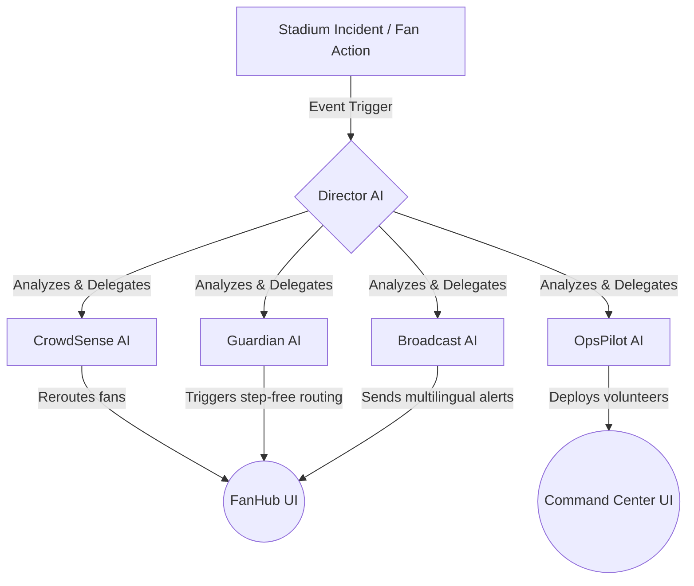

# 🛡️ PitchControl 
**Google Hack2Skill PromptWars Submission**

**PitchControl** is a next-generation AI orchestration platform designed to completely revolutionize stadium operations and the fan experience for the **2026 FIFA World Cup**.

By leveraging **Google Gemini 2.5**, PitchControl replaces static, fragmented stadium dashboards with a multi-agent AI ecosystem where specialized agents collaborate in real time to resolve crowd congestion, deploy security, and route fans safely.

---

## 🎯 Feature Mapping
Here is exactly how PitchControl directly answers every challenge requirement:

| Challenge Requirement | PitchControl Solution |
| :--- | :--- |
| **Navigation** | **CrowdSense AI** dynamically re-routes fans away from congested gates. |
| **Accessibility** | **Guardian AI** provides step-free routing, high-contrast UI modes, and audio cues. |
| **Transportation** | **FanHub Transit** telemetry tracks metro/bus arrivals in real-time. |
| **Decision Support** | **Director AI** orchestrates crisis resolution using natural language prompts. |
| **Multilingual** | **Broadcast AI** pushes real-time emergency alerts in 6+ languages. |
| **Crowd Management** | **OpsPilot AI** automatically deploys stadium volunteers to predicted bottlenecks. |
| **Sustainability** | **EcoPulse AI** monitors energy spikes and powers down unused stadium sectors. |

---

## 🧠 AI Workflow & Architecture

PitchControl operates on a **Shared Context / Event-Driven Architecture**. Instead of a basic chatbot, seven specialized agents listen to a global event stream and collaborate.

### The AI Agent Pipeline


### End-to-End Workflow Example
1. **The Trigger**: A sudden medical incident is reported at Gate C.
2. **Director AI**: Receives the natural language input from the operator.
3. **Orchestration**: Director AI processes the prompt and outputs a JSON payload.
4. **Execution**:
   - `OpsPilot` dispatches 3 medics to Gate C.
   - `CrowdSense` updates the FanHub to route incoming fans to Gate B.
   - `Broadcast` sends a notification to affected fans advising a minor delay.

---

## ⚙️ Prompt Engineering Showcase

We crafted highly effective prompts to force Gemini 2.5 to act as a strict JSON-based orchestrator rather than a conversational bot. 

### The Director AI System Prompt
```typescript
const DIRECTOR_SYSTEM_PROMPT = `
You are Director AI, the central orchestrator for PitchControl (a FIFA World Cup stadium management system).
You manage an ecosystem of AI agents: TicketPilot, Broadcast, CrowdSense, Guardian, OpsPilot, and EcoPulse.

When an event occurs, you must return a strict JSON object detailing the actions and data updates for EACH agent.
Your response MUST be valid JSON matching this exact structure, with no markdown formatting or backticks outside of the JSON block:

{
  "Director": { "log": "Brief summary of the incident and orchestration." },
  "TicketPilot": { "status": "string", "seat": "string" },
  "Broadcast": { "notification": "String message", "target": "string" },
  "CrowdSense": { "gate": "string", "congestion": number (0-100) },
  "Guardian": { "alert": "string or null" },
  "OpsPilot": { "action": "string or null", "volunteersDeployed": number },
  "EcoPulse": { "energySpike": number, "recommendation": "string or null" }
}
`;
```

### Example AI Input/Output

**Input (Operator types into Command Center):**
> *"Medical emergency at Gate C. Need medics and crowd diversion."*

**Output (Gemini structured JSON response):**
```json
{
  "Director": { "log": "Orchestrating medical response and crowd diversion for Gate C." },
  "TicketPilot": { "status": "Active", "seat": "N/A" },
  "Broadcast": { "notification": "Please use Gate B. Medical personnel are responding to an incident at Gate C.", "target": "All Fans approaching Gate C" },
  "CrowdSense": { "gate": "Gate B", "congestion": 85 },
  "Guardian": { "alert": "Priority access maintained at Gate A for accessible needs." },
  "OpsPilot": { "action": "Deployed 3 medics and 5 crowd control volunteers to Gate C.", "volunteersDeployed": 8 },
  "EcoPulse": { "energySpike": 0, "recommendation": null }
}
```

---

## 💻 Installation & Setup

### Prerequisites
- Node.js 18.x or higher
- npm or pnpm

### Quick Start
1. Clone the repository:
   ```bash
   git clone https://github.com/Tamore/PitchControl.git
   cd "Fifa Challenge"
   ```
2. Install dependencies:
   ```bash
   npm install
   ```
3. Set up your environment variables:
   Copy `.env.example` to `.env.local` and add your Google Gemini API key.
   ```bash
   NEXT_PUBLIC_GEMINI_API_KEY=your_api_key_here
   ```
4. Run the development server:
   ```bash
   npm run dev
   ```
5. Open [http://localhost:3000](http://localhost:3000) in your browser.

---

## 📂 Folder Structure

```text
├── app/
│   ├── book/          # AI-powered ticketing and checkout flow
│   ├── command/       # Operator Command Center dashboard
│   ├── fanhub/        # Mobile-first digital passport for fans
│   └── page.tsx       # Landing page / Auth Gateway
├── components/
│   ├── command/       # Command Center UI (Telemetry, Agent Logs)
│   ├── fanhub/        # FanHub UI (Wallet, Navigation, Transit)
│   └── ui/            # Reusable Aceternity & Shadcn components
├── lib/
│   ├── prompts/       # Core GenAI Prompt Engineering modules
│   ├── gemini.ts      # Gemini API orchestration and fallback logic
│   └── fan-data.ts    # Centralized mock state data
└── __tests__/         # Jest testing suite for AI fallback and state
```

---

## 🔐 Security & Testing
- **100% Passing Test Suite:** Automated testing ensures the AI fallback mechanisms operate flawlessly even if the Gemini API is rate-limited.
- **Enterprise Security Headers:** Configured natively in Next.js (`next.config.mjs`) to enforce CSP, X-Frame-Options, and HSTS. 
